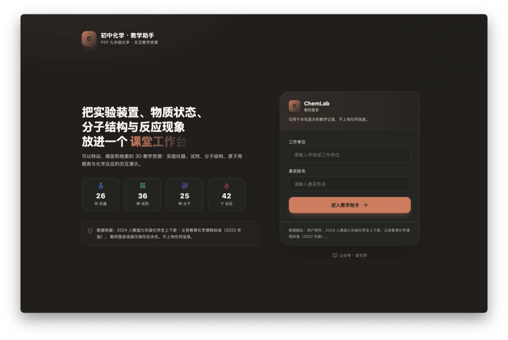
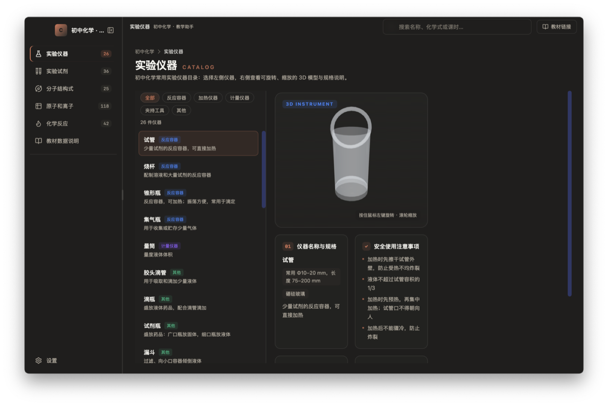
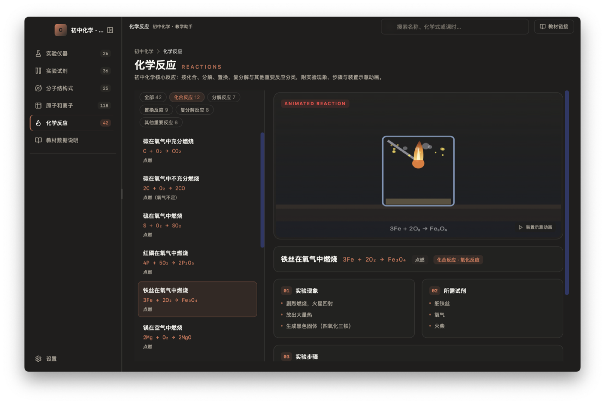
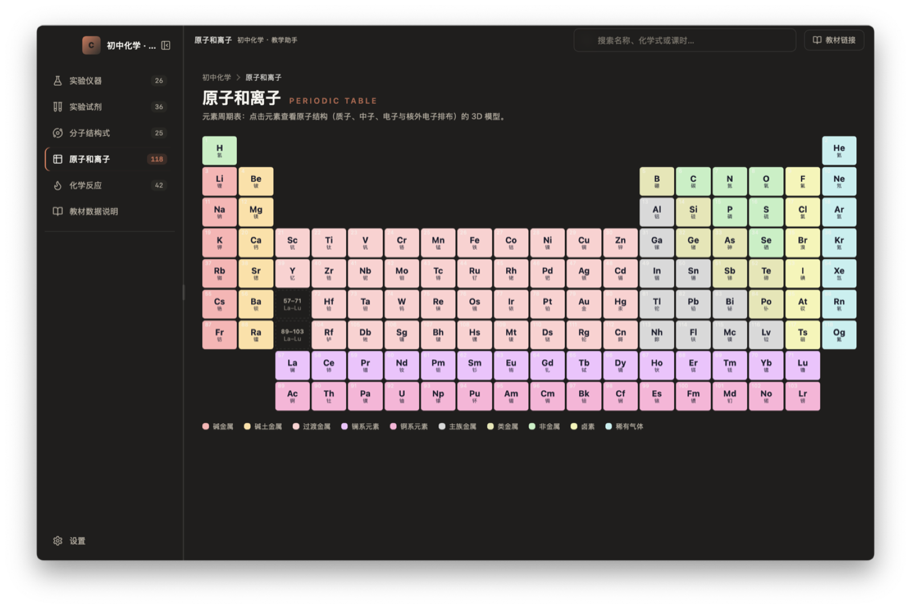
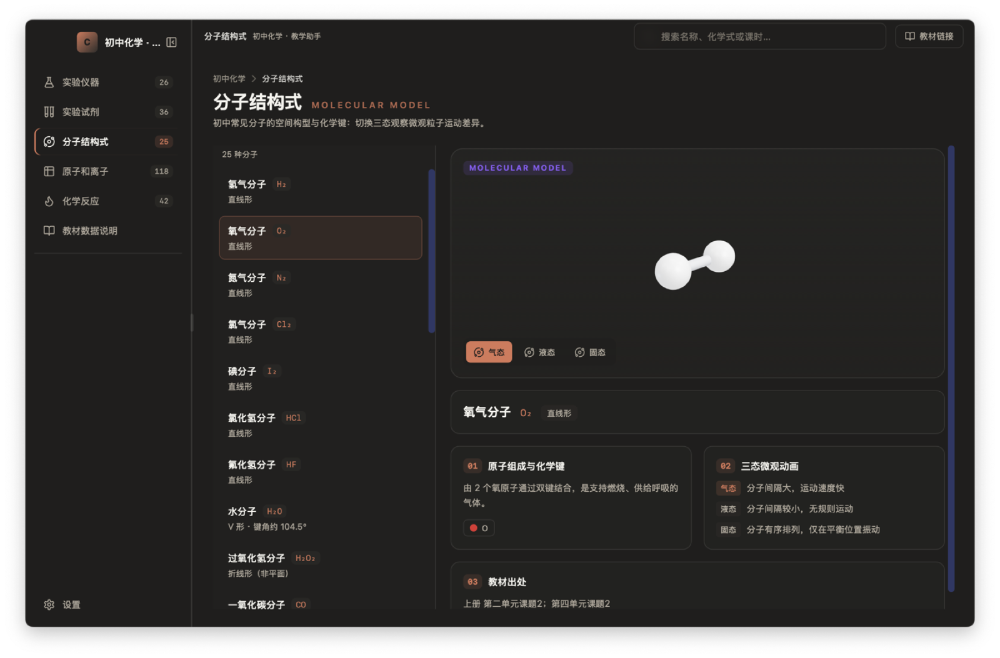
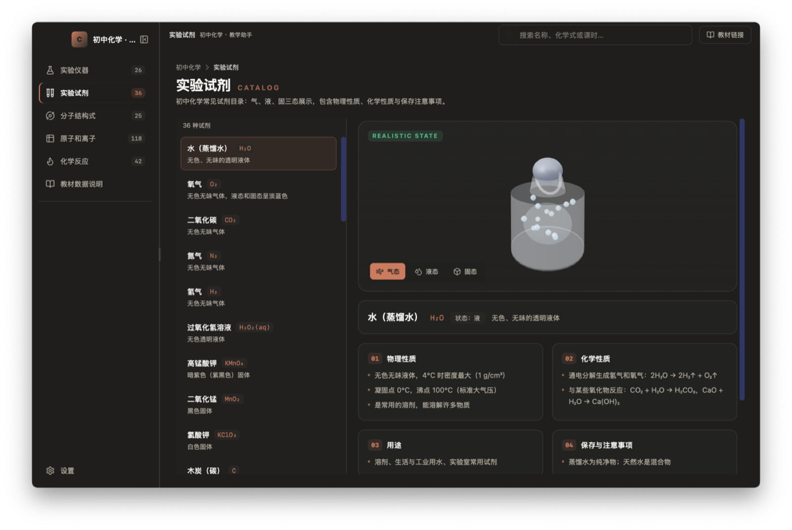

# 初中化学 · 教学助手（ChemLab）

基于 **Wails3** 的初中化学交互式教学资源桌面应用 —— 把实验装置、物质状态、分子结构与反应现象放进一个可以**转动、缩放和检索**的课堂工作台。

数据对照 2024 人教版九年级化学全上下册与《义务教育化学课程标准（2022 年版）》整理，面向课堂演示与自习使用。

## 界面预览

### 教师登录


首次启动进入教师登录页：填写工作单位与真实姓名后进入教学助手。登录信息仅保存在本机，不上传任何信息。

### 实验仪器（3D 目录）


26 件常用仪器，左侧目录列表 + 右侧可旋转、缩放的 3D 模型，含规格、安全注意事项、涉及实验与教材出处。

### 化学反应（装置示意动画）


42 个核心反应，按化合（12）、分解（7）、置换（9）、复分解（8）与其他重要反应（6）分类，附实验现象、步骤与装置示意动画。

### 原子和离子（元素周期表）


完整 118 号元素周期表，按类别着色；点击元素查看原子结构 3D 模型（质子、中子、核外电子排布）。

### 分子结构式（三态动画）


25 种常见分子的球棍模型，支持气态 / 液态 / 固态三态微观动画切换，附空间构型与键角说明。

### 实验试剂（真实状态）


36 种常见试剂的真实状态 3D 展示（气 / 液 / 固切换），含物理性质、化学性质、用途与保存注意事项。

## 功能一览

| 模块 | 内容 | 数量 |
|------|------|------|
| 实验仪器 | 仪器目录 + 3D 可旋转模型 + 规格 / 安全 / 涉及实验 / 教材出处 | 26 件 |
| 实验试剂 | 真实状态 3D（气/液/固）+ 物理 / 化学性质 / 保存事项 | 36 种 |
| 分子结构式 | 球棍模型 + 三态微观动画 + 构型 / 键角 / 化学键 | 25 种 |
| 原子和离子 | 完整 118 元素周期表 + 原子结构 3D | 118 个 |
| 化学反应 | 五大反应类型 + 装置示意动画 + 现象 / 步骤 / 试剂 | 42 个 |
| 教材数据说明 | 数据来源、组织方式、使用说明与免责声明 | — |

其他特性：
- **教师登录**（本地保存，不上传任何信息）+ 侧边栏教师信息展示
- **全局搜索**：按名称、化学式或课时关键词实时过滤当前页面
- **15 套内置主题**（默认「化学实验室」清新蓝白），浅色 / 深色 / 跟随系统
- 无边框窗口 + 自定义标题栏 + 系统托盘 + 开机自启 + 单实例
- 3D 渲染基于 three.js（WebGL），不支持 WebGL 的环境自动降级为静态示意

## 技术栈

| 层 | 技术 |
|----|------|
| 后端 | Go 1.27 · Wails3 v3.0.0-beta |
| 前端 | React 18 · TypeScript · Vite · Tailwind CSS v4 |
| 3D | three.js（OrbitControls + RoomEnvironment 环境反射） |
| UI | shadcn/ui · Radix Primitives · lucide-react |
| 状态 | zustand（防抖持久化到 Go 后端） |
| 构建 | Wails3 Taskfile · NSIS（Windows）· DMG（macOS） |

## 项目结构

```
main.go                        Wails3 入口（配置 → 服务 → 窗口 → 托盘）
internal/
  config/                      应用配置（JSON，~/.chemlab/config.json）
  app/                         共享状态 + 服务（设置 / 版本 / 更新 / 自启 / 搜索）
frontend/
  src/
    App.tsx                    外壳：欢迎页门槛 + 侧边栏 + 顶栏搜索 + 页面切换
    pages/
      WelcomePage.tsx          ChemLab 教师登录页（统计 + 登录卡片）
      InstrumentsPage.tsx      实验仪器（3D 目录）
      ReagentsPage.tsx         实验试剂（真实状态 3D）
      MoleculesPage.tsx        分子结构式（三态动画）
      PeriodicPage.tsx         元素周期表 + 原子结构详情
      ReactionsPage.tsx        化学反应（装置动画）
      TextbookPage.tsx         教材数据说明
      SettingsPage.tsx         通用 / 主题 / 关于
    modules/
      data/                    全部教学数据（elements / instruments / reagents /
                               molecules / reactions / textbook）
      three/                   ThreeViewport 封装 + 仪器/分子/原子/试剂建模 + 反应动画
      theme/                   主题引擎（含默认「化学实验室」主题）
      settings/                偏好持久化（zustand → Go SettingsService）
    components/                共享 UI（搜索框、页头、目录布局等）
docs/screenshots/              界面截图
build/                         跨平台构建资产（图标、Info.plist、Taskfile）
```

## 快速开始

### 环境要求

- **Go** 1.27+（go.mod 要求 go 1.27）
- **Node.js** 20+
- **wails3 CLI**：`go install github.com/wailsapp/wails/v3/cmd/wails3@latest`
- **C 编译器**（CGO）：macOS 用 Xcode CLT，Windows 用 mingw-w64，Linux 用 gcc

### 构建与运行

```bash
# 1. 安装前端依赖
cd frontend && npm install && cd ..

# 2. 生成 Wails3 绑定（TS 模型由 Go 结构体生成）
wails3 generate bindings

# 3. 生产构建 → bin/chemlab.app（macOS）/ chemlab.exe（Windows）
wails3 build
wails3 package   # 打包 .app / DMG

# 4. 开发模式（前端热更新）
wails3 task dev
```

### 注意

- **npm registry**：package-lock.json 中的 tarball 地址为 `registry.npmmirror.com`；
  如需官方源可执行 `npm install --registry=https://registry.npmjs.org` 重新生成锁文件。
- **macOS 首次启动**：如提示「无法打开，因为无法验证开发者」，请在
  「系统设置 → 隐私与安全性」中允许，或执行 `xattr -cr bin/chemlab.app`。

## 数据说明

- 元素相对原子质量、氧化态参考 IUPAC 标准原子量及 PubChem 开放数据库，并与
  人教版教材附录核对。
- 3D 模型与反应动画为**教学示意**，不用于精确量取；实验操作以教材和教师指导为准。
- 教师登录信息仅保存在本机（WebView localStorage），不上传任何信息。

## License

MIT
